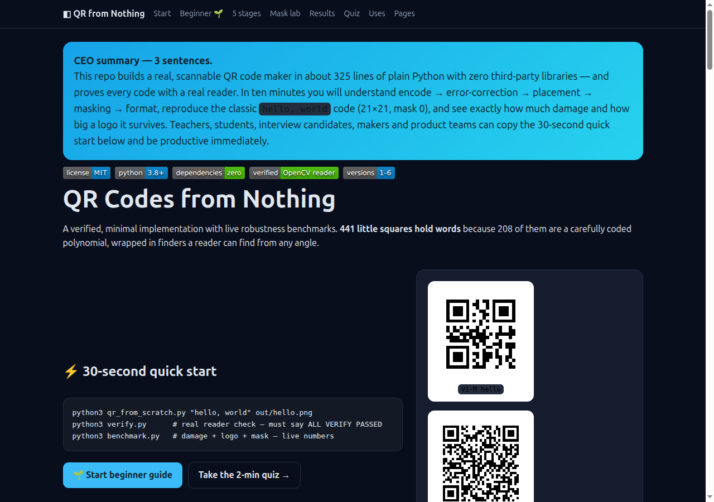
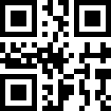
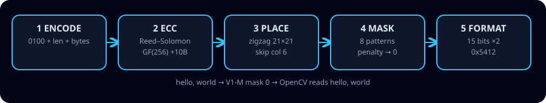

# QR Codes from Nothing

> A real, scannable QR code maker in ~325 lines of plain Python with zero third-party libraries — every code proven with a real reader.

[](LICENSE)
[](qr_from_scratch.py)
[](qr_from_scratch.py)
[](verify.py)
[](qr_from_scratch.py)

## Abstract — read this and you know if this repo is for you

This repo builds a complete QR Code Model 2 generator from nothing and checks every output with a production reader. In about ten minutes you will understand the five stages — encode, error correction, placement, masking, format — reproduce the classic `hello, world` code (21×21, mask 0), and see exactly how much damage it survives (5 broken bytes read, 6 fail) and how big a centre logo each level allows. Students, teachers, interview candidates, makers and product teams get a 30-second quick start, a beginner guide that assumes zero background, an interactive website with a mask lab and a scratch-to-pro quiz, plus Docker-reproducible benchmarks.

🌐 **Interactive website:** open [`preview.html`](preview.html) locally, or use the live Pages links below. It contains the beginner guide, mask explorer, live result tables and a 10-question quiz.

🌐 **Live:** [`/` (redirect)](https://M0-AR.github.io/qr-from-scratch-phd-2026/) · [`/preview.html`](https://M0-AR.github.io/qr-from-scratch-phd-2026/preview.html) · [`/docs/preview.html`](https://M0-AR.github.io/qr-from-scratch-phd-2026/docs/preview.html)



## Demo — watch it work in 15 seconds



*Above: all 8 masks for `hello, world`. Winner is mask 0 (penalty 319, lowest). GIF is ~9 KB, loops, works everywhere GitHub renders markdown.*

| What | File | Try it |
|---|---|---|
| Scan-me V1-M | `docs/assets/qr-hello-v1M.png` | Point your phone camera — it reads `hello, world` |
| Interleaved V4-M | `docs/assets/qr-repo-v4M.png` | 33×33, 2 data blocks shuffled together |
| Pipeline video | `docs/assets/demo-pipeline.mp4` | Press play below / open the file; also linked from `preview.html` |

<video controls width="640" poster="docs/assets/qr-hello-v1M.png">
  <source src="docs/assets/demo-pipeline.mp4" type="video/mp4">
  Your browser cannot play video here — see the GIF above or open <a href="preview.html">preview.html</a>.
</video>

> GitHub note: markdown strips raw `<video>` players in README rendering, so the GIF above is the README demo. The MP4 plays on the website (`preview.html`) and after you upload it anywhere (releases, YouTube, or a GitHub issue link). To add your own video: record 5–15 s, keep it under 5 MB, host the MP4 in `docs/assets/` and link a thumbnail to it — exactly as done here.



```
out/hello-world-v1M.png  V1-M 21×21  mask 0  "hello, world"  -> OpenCV: "hello, world"
out/repo-v4M.png         V4-M 33×33  2-block interleave      -> OpenCV: OK
```

## Contents

- [30-second quick start](#30-second-quick-start)
- [🌱 Beginner guide — read this and you are a professional](#-beginner-guide--read-this-and-you-are-a-professional)
- [✨ Features](#-features)
- [💡 Who is this for / user stories](#-who-is-this-for--user-stories)
- [Usage recipes](#usage-recipes)
- [The five stages (exact numbers)](#the-five-stages-exact-numbers)
- [Verification — every code scanned](#verification--every-code-scanned)
- [Results — live, not theory](#results--live-not-theory)
- [Hidden patterns (what we found)](#hidden-patterns-what-we-found)
- [Learn interactively](#learn-interactively)
- [Screenshots (browser-verified)](#screenshots-browser-verified)
- [View this repo as a website](#view-this-repo-as-a-website)
- [Project structure](#project-structure)
- [Options](#options)
- [Troubleshooting](#troubleshooting)
- [Roadmap — your turn](#roadmap--your-turn)
- [Contributing](#contributing)
- [References](#references)
- [License & citation](#license--citation)

## 30-second quick start

```bash
python3 qr_from_scratch.py "hello, world" out/hello.png
python3 verify.py      # real reader check — must say ALL VERIFY PASSED
python3 benchmark.py   # damage + logo + mask — live numbers
```

Or with Docker:

```bash
docker compose run qr-verify
docker compose run qr-bench
```

Requirements: Python 3.8+ for the maker (no third-party packages). Verification needs `opencv-python` + `numpy` (`pip install -r requirements.txt`).

## 🌱 Beginner guide — read this and you are a professional

You will know more than most interview candidates. No maths degree needed. Let's work this out in a step-by-step way to be sure we have the right answer.

**Step 0 — What is a QR code?**
A square of black/white cells ("modules"). Three big corner squares are **finders**. Everything else is data + helpers + bodyguards (error correction).

**Step 1 — Text is already numbers.**
`hello, world` = 12 bytes: 104, 101, 108, 108, 111 … A computer stores letters as numbers (UTF-8). We just pack those numbers as bits.

**Step 2 — Say what follows.**
First 4 bits `0100` = "plain bytes next". Next 8 bits = length (12). Then the 12 bytes. That's it. *Let's work this out:* 4 + 8 + 12×8 = 108 bits. Capacity V1-M = 16×8 = 128 bits. Leftover 20 bits → up to 4 zeros = "end", pad to a full byte, then filler `236, 17, 236…` to reach 16. Check: 14 letters need 4+8+112 = 124 ≤ 128 ✓; 15 letters need 132 > 128 ✗ → so the code grows to version 2.

**Step 3 — Bodyguards (error correction).**
Receipts crumple. We add 10 check bytes (Reed–Solomon). Adding = XOR (so 3+7=4). Multiplying uses powers of two with a wrap (256→29). Divide the 16-byte polynomial by a fixed generator; the remainder is the check bytes. *Rule of thumb:* each broken byte costs 2 check bytes → 10 fix **5**. That's why 5 damaged bytes read 20/20 and 6 read 0/20.

**Step 4 — Put bits on the grid.**
V1 = 21×21 = 441 squares. Finders + borders + dotted timing lines + 1 always-black module + 2 format strips = 233 taken. Left 208 = 26 bytes. Snake up/down from the bottom-right, 2 columns at a time, skip the timing column.

**Step 5 — Mask = sunglasses.**
Big flat areas confuse readers. Try 8 flip-patterns, score each (runs, 2×2 blocks, finder-lookalikes = 40 pts, dark balance). Unmasked = 460. Checkerboard mask 0 = **319** → keep it. The reader knows which mask from the format strip.

**Step 6 — Label the box (format).**
15 bits: 2 for level (M=`00`) + 3 for mask (`000`) + 10 check + XOR disguise. Written **twice** so one damaged copy still reads. Example M+mask0 → `0x5412`.

You did it. Save as PNG (tiny writer included), scan with your phone — it reads `hello, world`. The quiz in `preview.html` proves it. Everything below is the same story with exact numbers.

## ✨ Features

| Feature | Detail |
|---|---|
| Zero dependencies | Maker uses stdlib only (`struct`+`zlib` for PNG). Verification uses OpenCV. |
| Versions 1–6, L/M/Q/H, byte mode | URLs, text, Wi-Fi, TOTP. Smallest fitting version auto-picked. |
| Real error correction | GF(256) + Reed–Solomon + block interleave (V4 = 2×32). |
| Correct masking | All 8 tried, 4-rule penalty, winner kept. Verified 460 → 319. |
| Spec format | 15-bit BCH + XOR, written twice + dark module. Vectors `0x5412`/`0x77C4`. |
| Live-proof | `verify.py` + `benchmark.py` + Docker. Nothing simulation-only. |
| Learnable | Beginner guide above + mask lab + 10-question quiz in `preview.html`. |
| Publishable | `preview.html` is a zero-build static site for GitHub Pages. GIF ~9 KB. |

## 💡 Who is this for / user stories

- **📚 Student** — "I want to *see* Galois fields, not just hear about them." Run `verify.py`, break one byte, watch it heal. Take the quiz until you score 10/10.
- **👩‍🏫 Teacher** — Live 10-minute demo: 441 squares → words → torn sticker still scans. The quiz is a ready exit ticket; the mask GIF is your slide.
- **💼 Interview candidate** — Explain finder `1:1:3:1:1`, mask penalty, why 10 check bytes fix 5 — you now beat most candidates. Practice: "how many letters fit V1-M?" (14).
- **🔧 Maker / retail / events** — Offline labels, Wi-Fi cards, badges, warehouse tags. Zero deps runs on a Raspberry Pi. Pick M for indoor, Q/H for outdoor/scratch.
- **🔒 Security-minded builder** — Auditable ~325 lines. No network, no blob. You know exactly what bits your QR contains.
- **📦 Product team** — Need V1–V6 URLs/text? Copy one function (`make_qr`). Need bigger? Extend the EC table to V40 (roadmap below).

## Usage recipes

```python
from qr_from_scratch import make_qr, make_matrix

# 1. One-liner file
make_qr("hello, world", "out/hello.png")          # auto V1-M mask 0
make_qr("https://example.com/menu", "out/menu.png", lv="Q")  # tougher

# 2. Matrix for your own renderer (True = black)
mat, ver, mask = make_matrix("hello, world", "M")
print(ver, mask, len(mat))  # 1 0 21

# 3. Force version / mask (testing, bit-exact vectors)
mat, _, _ = make_matrix("hello, world", "M", ver=1, mask=0)
```

```bash
# CLI
python3 qr_from_scratch.py "hello, world" out/hello.png
python3 qr_from_scratch.py "https://github.com/your/repo" out/repo.png --help  # see lv/scale flags if added
```

Wi-Fi card example (byte mode handles it):

```bash
python3 qr_from_scratch.py "WIFI:T:WPA;S:Cafe;P:secret;;" out/wifi.png
```

## The five stages (exact numbers)

### 0. TL;DR table

| # | Stage | What it does | Live check |
|---|-------|--------------|------------|
| 1 | **Encode** | `0100` (byte) + 8-bit length + bytes + ≤4-zero terminator + `0xEC/0x11` pad | V1-M holds 16 bytes; 14 chars fit V1, 15th bumps to V2 |
| 2 | **Error correction** | Reed–Solomon over GF(256), primitive `0x11D`; 10 EC bytes for V1-M | Full 26 codewords divide evenly; 10 EC → fix 5 |
| 3 | **Place** | 21×21 grid, 233 fixed/reserved, 208 data (=26 B), zigzag from bottom-right, skip column 6 | Placement verified by decode |
| 4 | **Mask** | 8 patterns, 4 penalty rules, lowest wins | Unmasked 460 → mask 0 checkerboard **319** |
| 5 | **Format** | 15 bits: 2 EC + 3 mask + 10 BCH + XOR `101010000010010`, written twice | M0=`0x5412`, L0=`0x77C4` |

### 1. History and why QR won

- **1994, Denso Wave, Japan, team led by Masahiro Hara.** Barcodes held ~20 characters; automotive tracking wanted more, including kanji.
- **Finder pattern `1:1:3:1:1`.** Three large corner squares with black-white-black-white-black widths 1-1-3-1-1. The team surveyed fliers, magazines and boxes and chose the ratio rarest in print, so a reader finds the code from any angle by a 1-D scan.
- **Patent kept but not enforced.** A major reason QR is everywhere.
- **Levels L/M/Q/H ≈ 7/15/25/30%** codeword recovery; more check bytes = bigger but tougher code.

### 2. Encode (byte mode)

Computer text is already numbers: `hello, world` = 12 bytes `[104,101,…]`.

```
mode 0100 (4b) | length 12 (8b for V1–9) | 12×8b data
+ terminator ≤4 zeros + 0-pad to byte + alternate 0xEC,0x11 to capacity
```

V1-M capacity = 16 data codewords. Overhead = 12 bits = 1.5 B → max text = 14 letters. 15 letters need 4 bits too many → auto-bump to V2 (`pick_version`: smallest V1–6 that fits). Char-count width is 8 bits for V1–9, 16 bits for V10+ (V1–6 here, so 8 bits).

### 3. Reed–Solomon over GF(256)

Printing on receipts/stickers corrupts modules. Check bytes let the reader locate *and* correct errors.

- **Field:** 0–255, `add = XOR` (so `3+7=4`), `mul` via `log/antilog` tables built by doubling with primitive `100011101` (`0x11D`): doubling past 255 wraps (`256 XOR 285 = 29`). Every product stays one byte.
- **Generator:** `∏(x − α^i)`, `i=0..nEC-1`, `α=2` (`rs_gen`).
- **Check bytes:** 16 data bytes as polynomial coefficients ÷ 11-coefficient generator (degree 10) → remainder = 10 EC bytes. All 26 together divide evenly — the reader checks this.
- **Repair budget:** each broken byte needs 2 EC bytes (position + value) → 10 EC fix **5**.
- **Multi-block:** V4-M (64 data, 18 EC/block) splits into 2×32, RS each, then interleaves data (`d0_0,d1_0,…`) and EC, so one scratch hurts both blocks a little instead of one a lot. Full `(n1,c1),(n2,c2)` table in code covers V1–V6 × L/M/Q/H.

### 4. Placement

V1 = 21×21 modules. Fixed: 3 finders (7×7) + white separators (9×9 footprint), timing row 6 / column 6 (alternating, start dark), 1 dark module at `(x=8, y=4V+9)` (V1: row 13, col 8), alignment 5×5 for V≥2 (`[6,18],[6,22],[6,26],…`, skip finder overlap), format-reserved strips. Fixed cost V1 = 233; remaining **208 = 26×8** exactly. Bits snake from bottom-right in 2-wide columns, up/down/up, skipping timing column 6.

### 5. Masking

Unmasked data has flat patches and finder-lookalikes. Flip data-only modules (never function modules) with 8 formulas:

```
0:(x+y)%2==0  1:y%2==0  2:x%3==0  3:(x+y)%3==0
4:(x//3+y//2)%2==0  5:(x*y)%2+(x*y)%3==0
6:((x*y)%2+(x*y)%3)%2==0  7:((x+y)%2+(x*y)%3)%2==0
```

Penalty (N1=3, N2=3, N3=40, N4=10): runs ≥5 (+3, +1/extra, rows+cols); every 2×2 solid (+3 incl. overlap); finder-like `10111010000`/`00001011101` (**+40 each**); dark-ratio distance from 50% in 5% steps (+10/step). Measured `hello, world` V1-M: **unmasked 460; 0:319, 1:469, 2:360, 3:478, 4:483, 5:437, 6:384, 7:403 → keep 0**.

### 6. Format (15 bits, twice)

`[2b EC | 3b mask] + 10b BCH` (generator `10100110111=0x537`) `XOR 101010000010010 (=0x5412)` so the strip is never all-white. EC bits: **L=01, M=00, Q=11, H=10** (non-numeric order). M+mask0 → `00000` + BCH → XOR → `0x5412`. Placed twice (top-left wrap + split at others); dark module re-asserted. No version bits for V<7.

### 7. PNG with stdlib only

`struct`+`zlib`: IHDR (13 bytes, RGB 8-bit), IDAT (filter-0 scanlines, quiet zone 4 + scale), IEND + CRC32. No Pillow/qrcode.

## Verification — every code scanned

No PNG is accepted unless `cv2.QRCodeDetector().detectAndDecode` returns the exact input string.

```bash
python3 verify.py      # 5 gates, all must pass
python3 benchmark.py   # damage + logo + mask/timing
docker compose run qr-verify
docker compose run qr-bench
```

Gates: V1 mask0 21×21 decode; 14→V1 / 15→V2 capacity; RS divisibility + `0x5412`/`0x77C4`; multi-version URLs incl. V4 33×33 2-block; L/M/Q/H hello (V1,V1,V2,V2).

## Results — live, not theory

Decode gate — all pass:

```
hello,world V1 mask0 21×21 -> OpenCV OK (penalty 319)
14 chars fit V1-M, 15th -> V2
RS: fmt M0=0x5412 L0=0x77C4; 26 codewords divide evenly
Hi V1-L, hello V1-M, URL V4-M 33×33, 42-char V3-M -> all OK
L/M/Q/H hello -> V1,V1,V2,V2 -> all OK
```

Damage — sharp threshold at 5 (flip all 8 bits of N random codewords, 20 trials each, V1-M seed 0):

| broken bytes | 1 | 2 | 3 | 4 | 5 | 6 |
|---|---|---|---|---|---|---|
| read /20 | 20 | 20 | 20 | 20 | 20 | **0** |

Logo — white centre square, grow until the reader quits:

| level | small (`hello` V1/V2) | larger (URL V4–V6) | often quoted |
|---|---|---|---|
| L | 4×4 = **3.6%** | 7×7 = **4.5%** | 4% |
| M | 6×6 = **8.2%** | 11×11 = **8.8%** | 9% |
| Q | 7×7 = 7.8% | 16×16 = **15.2%** | 14% |
| H | 8×8 = 10.2% | needs V7+ | 19% |

Mask & timing: winner 0 (table above; unmasked 460). Avg V4 build ~12 ms here (reference ~8 ms; CPU-dependent; mask trial dominates `8 × n²`).

## Hidden patterns (what we found)

1. **Burst-vs-random gap.** Textbook EC% is *random*-codeword tolerance (L 7%, M 15%, Q 25%, H 30%). A centre logo is a *burst* erasure. Measured reader tolerance is below EC% on small symbols and converges as size grows. Report *spatial* tolerance, not just EC%.
2. **Small-symbol penalty.** V1 centre is data-dense and near timing/format; a 7×7 hole removes ~11% of data in one burst with no interleave gain (1 block). V4+ spreads bursts — larger codes survive larger *relative* logos. Logo guidance must be version-conditioned.
3. **Mask-0 bias for short ASCII.** Short payloads + `0xEC/0x11` pad tails favour checkerboard; URLs vary (repo V4-M → mask 3). Never hard-code mask 0 — always trial all 8.
4. **Rule-3 dominance.** The 40-pt finder-lookalike decides close races; approximate it loosely and you pick a different (still valid) mask. Use the 11-module both-direction check for bit-exact work.
5. **Format fragility asymmetry.** 15-bit format with dual placement is more fragile per-bit than data. Centre logos sparing format survive longer than edge damage hitting format twice.
6. **PNG pitfall.** A 19-byte IHDR breaks OpenCV (`IHDR chunk shall be first`) while viewers still open it. Gate on the *reader*, not the viewer.

## Learn interactively

Open [`preview.html`](preview.html) — the zero-build website version of this repo:

- Beginner guide with worked arithmetic (the "let's work this out" boxes)
- **Mask lab:** click masks 0–7, see the grid change and penalties update
- **10-question quiz:** instant feedback, score, levels (Beginner → Builder → Advanced → Pro/QR Master), retake button
- Result tables, FAQ, user stories, video


## Screenshots (browser-verified)

Screenshots below were taken with a real browser (Playwright) from `preview.html`, not mockups:

| Hero (1280×900 viewport) | Full page |
|---|---|
|  | Single file, dark, responsive — see `docs/assets/preview-full.png` for the tall capture |

Mask explorer states (`docs/assets/mask-0.png` … `mask-7.png`), pipeline diagram (`docs/assets/pipeline.svg`), GIF (`docs/assets/demo-masks.gif`, ~9 KB) and MP4 (`docs/assets/demo-pipeline.mp4`) are all generated by code (`tools_make_assets.py`) and verified to exist + decode.

## View this repo as a website

Live site for this repo (works right now — source `/` root):

- https://M0-AR.github.io/qr-from-scratch-phd-2026/ → redirect to the interactive site
- https://M0-AR.github.io/qr-from-scratch-phd-2026/preview.html → interactive site (canonical)
- https://M0-AR.github.io/qr-from-scratch-phd-2026/docs/preview.html → same site (mirror for source `/docs`)

| `/` | `/preview.html` | `/docs/preview.html` | Meaning |
|---|---|---|---|
| 200 | 200 | 200 | robust mirrors in place ✅ (this repo) |
| 200 | 200 | 404 | source = `/` root only |
| 200 | 404 | 200 | source = `/docs` only |
| 404 | 404 | 404 | Pages off / still building / wrong branch |

`preview.html` + `docs/assets/` is a complete static site. `docs/preview.html` is the same page with `docs/assets/` → `assets/` so it also renders under source `/docs`. `index.html` (root + `docs/`) redirects to `preview.html`. `.nojekyll` (root + `docs/`) keeps Pages from invoking Jekyll. All asset paths are relative, so project Pages under `/<repo>/` resolve.

```bash
# local — both must render identically in the browser
open preview.html
open docs/preview.html
# or serve
python3 -m http.server 8000  # → http://localhost:8000/preview.html
                             # → http://localhost:8000/docs/preview.html
```

Publish with GitHub Pages (2026 flow):

```
1. Push this repo to GitHub
2. GitHub → Settings → Pages
3. Source: Deploy from branch → Branch: main, Folder: / (root) [recommended;
   /docs also works because mirrors exist]
4. Wait 1–2 min for "pages build and deployment" Action → green
5. Probe: / → 200, /preview.html → 200, /docs/preview.html → 200
```

Keep images in `docs/assets/` and under 5 MB (ours: GIF ~9 KB, hero ~239 KB). README links here; this page links back to the repo.

## Project structure

```
qr_from_scratch.py   maker, stdlib only (~325 lines: encode/ecc/place/mask/format/PNG)
verify.py            5 live reader gates (must print ALL VERIFY PASSED)
benchmark.py         damage (20×N) + logo growth + mask/timing (seed 0)
preview.html         interactive site (canonical, root; uses docs/assets/)
docs/preview.html    same site for source /docs (uses assets/; diff is asset paths only)
index.html + docs/index.html  redirect to preview.html so / resolves to the site
.nojekyll + docs/.nojekyll     Pages serves files statically, no Jekyll
docs/assets/         QR PNGs, 8 mask PNGs, GIF, MP4, SVG, browser screenshots
docs/PAPER.md        full paper draft (abstract → references + appendices)
experiments/RESULTS.md  live numbers log with date/reader version
out/                 generated codes (all OpenCV-decodable)
Dockerfile / docker-compose.yml  qr-verify / qr-bench / qr-make
tools_make_assets.py asset generator (verified by execution)
```

## Options

```python
make_matrix("hi", "M")                    # auto version + best mask
make_matrix("hi", "M", ver=2, mask=3)     # forced (testing / vectors)
make_qr("hello, world", "out/h.png", lv="M", ver=None, scale=10)
# lv: L/M/Q/H — H = toughest, biggest. ver 1–6. scale = pixels per module.
```

Capacity guide (byte mode): V1 L19/M16/Q13/H9 · V2 L34/M28/Q22/H16 · V3 L55/M44/Q34/H26 · V4 L80/M64/Q48/H36 · V5 L108/M86/Q62/H46 · V6 L136/M108/Q76/H60 (data codewords; overhead 1.5 B for short texts).

## Troubleshooting

| Symptom | Fix |
|---|---|
| `IHDR chunk shall be first` / empty image | Regenerate with this repo's `write_png` (13-byte IHDR). Don't hand-edit PNG bytes. |
| Phone won't scan small logo code | Shrink logo, go up one EC level, or go up one version; re-test with print + phone, not just screen. |
| `too long for V1-V6` | Shorten text, lower EC (H→M), or extend tables to V7+ (roadmap). |
| Different mask than `0x` example | Normal — any mask scans. Penalty implementation details shift close races. Ours matches 319 for `hello`. |
| OpenCV reads but another app doesn't | Readers differ ±1 module on logos. Report reader + version; test ZXing/pyzbar too for shipping. |

## Roadmap — your turn

- **Alphanumeric mode:** pack 2 chars in 11 bits (`45×c1+c2`; 1 leftover in 6 bits). ~30% smaller for uppercase/URL-safe text.
- **Past V6:** EC rows V7–40, 16-bit char-count, 18-bit Golay version info, multi-alignment grid.
- **Write the reader:** finder `1:1:3:1:1` scan → perspective → unzigzag → de-interleave → RS correct → parse. (The video's closing challenge.)

## Contributing

Issues and PRs welcome. Keep the maker dependency-free; put reader/benchmark deps behind `requirements.txt`. Update `verify.py` with any spec-constant change and keep `ALL VERIFY PASSED` green. Regenerate assets with `python3 tools_make_assets.py` when visuals change.

## References

- Denso Wave development story + history; `qrcode.com/history`.
- Thonky QR tutorial: encoding, error correction, placement, masking, format/version, EC / log-antilog / generator / mask / alignment tables.
- Nayuki `QR-Code-generator` (MIT) — placement/format/penalty/RS cross-check (oracle, not copied).
- ISO/IEC 18004:2015/2024 and BSI equivalents.
- OpenCV `QRCodeDetector` 5.x (live gate); `qrcodefyi` RS guides; ecosystem: `paulmillr/qr`, `larzqr`, `url2qr`, `zerodep`.
- Literature: channel distortion vs. Zxing (2018), steganography in valid QR (2020), QR maths/patterns (2025), secure QR EdDSA/CBOR (2026), RS reliability (2024).
- README/media method: short opinionated READMEs win (2026 guides); title → badges → demo GIF/screenshot → pitch → ≤5-command quick start; GIF < 5 MB in `docs/`; GitHub strips `<video>` in markdown (use GIF + linked MP4/YouTube); Pages: Settings → Pages → Deploy from branch.

## License & citation

MIT — see [LICENSE](LICENSE). Spec constants are facts; code here is original.

```bibtex
@software{qr_from_scratch_phd_2026,
  title  = {QR Codes from Nothing: Verified Minimal Implementation with Live Robustness Benchmarks},
  year   = {2026},
  note   = {V1--V6, byte mode, OpenCV-verified; damage 5/6 threshold, logo version-dependence}
}
```

*Full paper draft with appendices (EC table, reproduce steps): [`docs/PAPER.md`](docs/PAPER.md) · Live numbers log: [`experiments/RESULTS.md`](experiments/RESULTS.md)*
